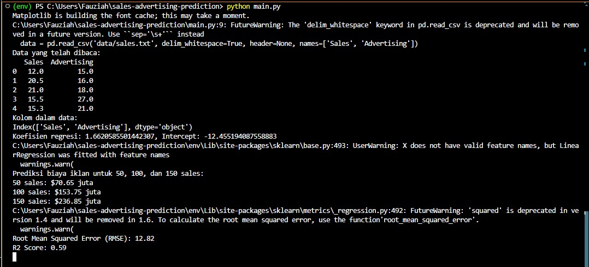
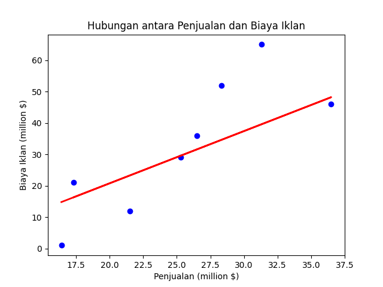

# Prediksi Biaya Iklan Berdasarkan Target Penjualan

Repositori ini berisi kode dan hasil untuk memprediksi biaya iklan berdasarkan target penjualan menggunakan simple regression.

## Langkah-langkah:

1. Download data dari [sini](https://www.econometrics.com/intro/SALES.txt) dan simpan sebagai `sales.txt`.
2. Baca dan simpan data menggunakan pandas.
3. Lakukan prediksi menggunakan simple regression.
4. Prediksi cost advertising untuk 50, 100, dan 150 sales.
5. Evaluasi model menggunakan RMSE dan R2 score.
6. Interpretasi hasil.

## Cara Menjalankan Kode:

1. Clone repositori ini.
2. Install dependensi yang diperlukan dengan menjalankan `pip install -r requirements.txt`.
3. Jalankan script `main.py` untuk melihat hasil prediksi dan evaluasi model.

## Screenshot Hasil

